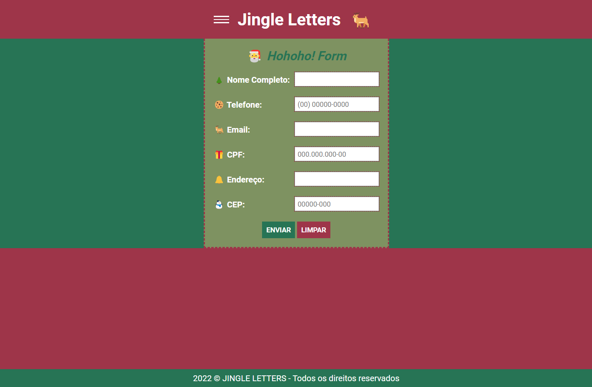

<h1 align="center">Jingle Letters</h1>

Send your Letter to Santa! 🎅

> Prática Front-end: jQuery plugins

Projeto de fim de ano desenvolvido para o estudo de bibliotecas JavaScript.

[🔗 Clique aqui para acessar](https://thiagonevesalmeida.github.io/jingle-letters/)

## 🛠️ Tecnologias

- HTML
- CSS
- JavaScript
- jQuery
- jQuery-plugins.

## 📨 Contato

- linkedin.com/in/thiagonevesdealmeida
- thiagonevesdealmeida@gmail.com
